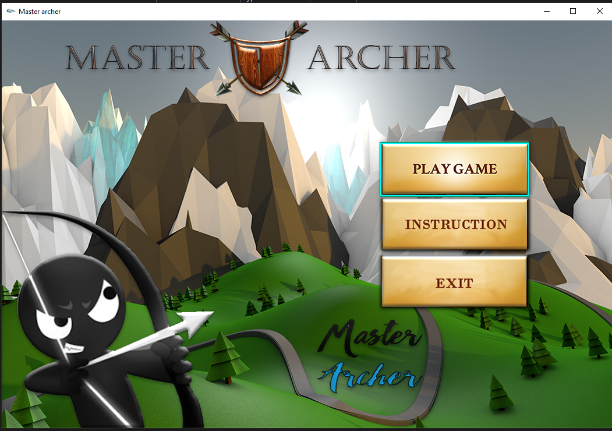
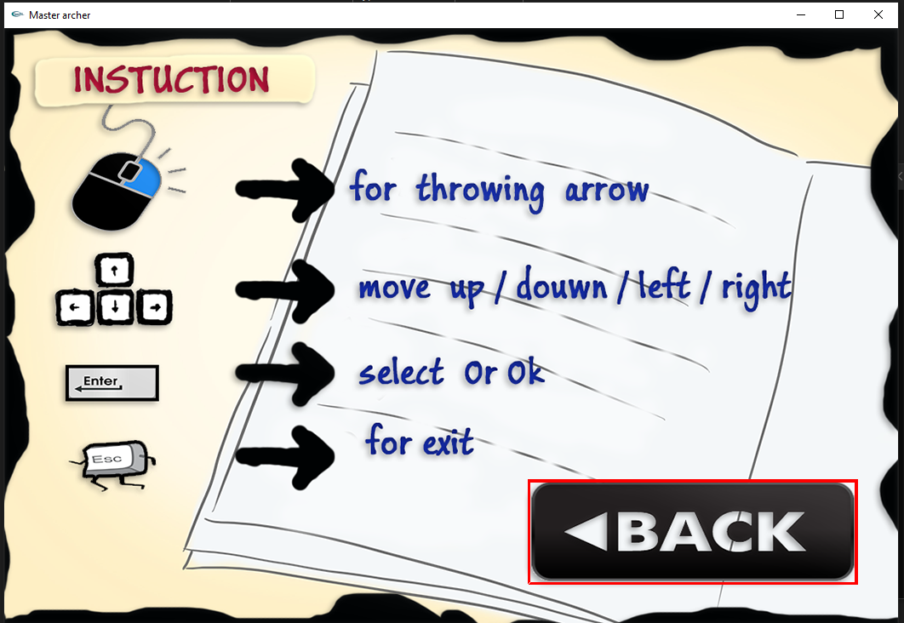
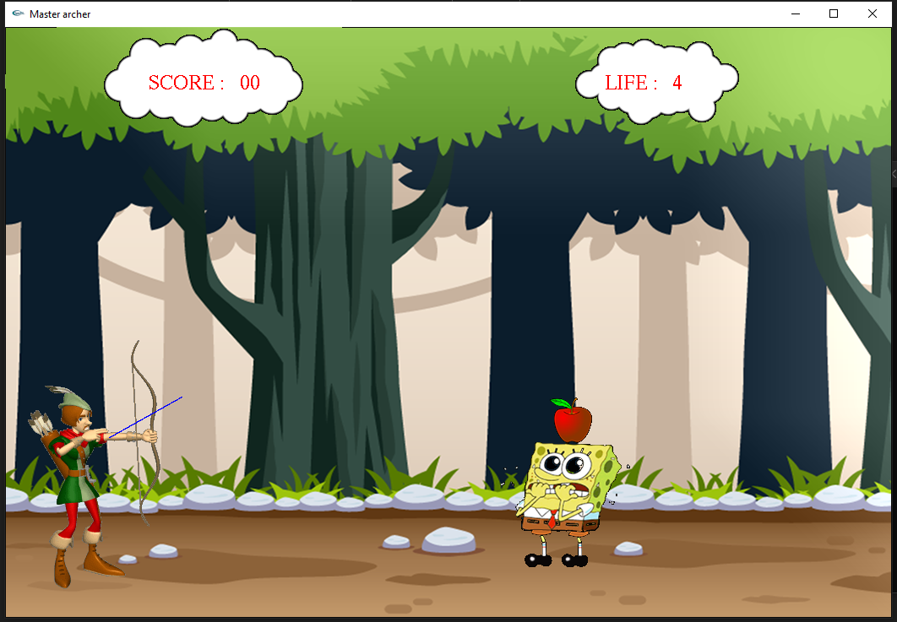
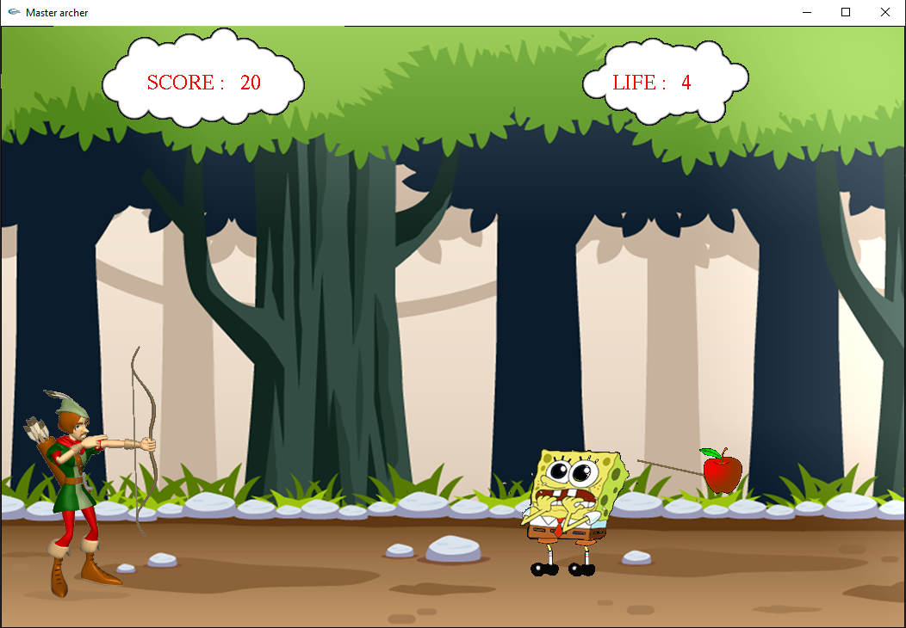
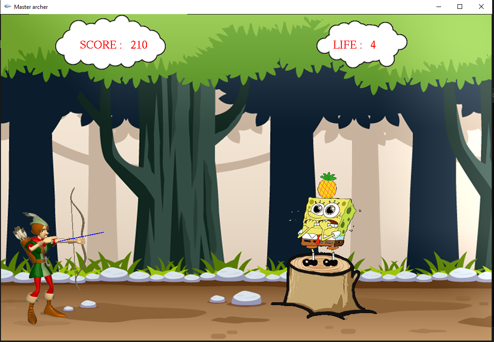
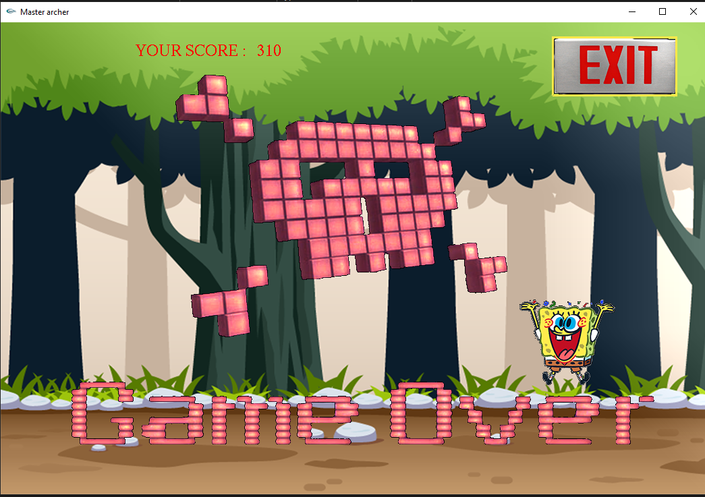

# Master_Archer
This game is made for my university project. I have no idea how to deals with animation and handle object motion. But after trying I have got this. And this is best project chosen by my lecturer. And also he gave me 10 marks extra. I got total 50/40 xD. 

## Project description
Name: Master Archer  
Programming Language: C & C++  
GUI: iGraphics
Project No: 4  
Year: 2017

## Demo Video

## Screen shot
### Homescreen
 

### Instruction Page
 

### Game Window
 

 

 

### GameOver
 

## Authors

* **AbirHasan**

Check out my other works [@XAbirHasan](https://github.com/XAbirHasan)